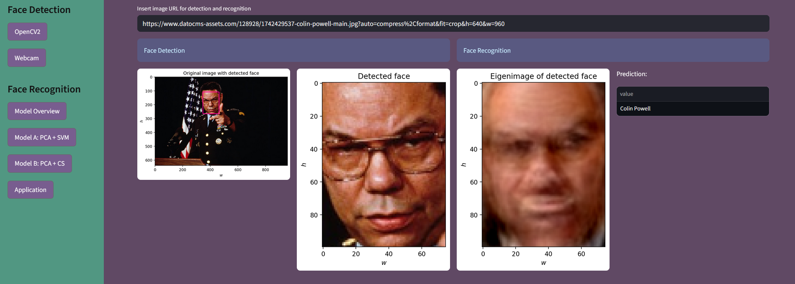

# 👤 Face Recognition with PCA, SVM & Cosine Similarity, based on LFW dataset
Link to app: https://lfw-face-recognition-demo.streamlit.app/

This project was developed as the final assignment of my Data Science Bootcamp (2025).  
The goal was to implement, compare, and deploy different approaches for face recognition using an interactive Streamlit app, providing a hands-on demonstration of machine learnaing technologies.

---

## ✨ Features
- **Technologies:** Python, NumPy, scikit-learn, openCV2, Streamlit  
- **Algorithms:** Principal Component Analysis (PCA), Support Vector Machines (SVM), Cosine Similarity  
- **Dataset:** [LFW – Labeled Faces in the Wild](https://scikit-learn.org/stable/modules/generated/sklearn.datasets.fetch_lfw_people.html) fetched from scikit-learn
- **Outcome:** Interactive face recognition app comparing two model approaches

---

## 📊 Approach
1. **Data preprocessing**  
   - Loading & cleaning the LFW dataset
   - Normalization
2. **Hyperparameter tuning**  
   - Grid search for optimal PCA and SVM parameters
   - Cross-validation for robust evaluation
3. **Model training**  
   - Dimensionality reduction using PCA
   - Training an SVM classifier
   - Cosine similarity as an alternative approach without traditional training
4. **Evaluation**  
   - Accuracy comparison
   - Confusion matrix visualization
5. **Deployment**  
   - Streamlit app for interactive testing

---

## 📈 Results
- **SVM model:** between 74.87% (19 different targets) and 95.15% (3 different targets) accuracy  
- **Cosine similarity:** between 77.54% (19 different targets) and 96.15% (3 different targets) accuracy  
- Screenshot of the app:  
  

---

## 🛠️ Installation & Usage
```bash
# Clone the repository and change into the directory
git clone https://github.com/sergejlembke/streamlit-face-recognition-app.git
cd streamlit-face-recognition-app

# Create and activate a virtual environment (recommended)
python -m venv venv
# On Windows:
venv\Scripts\activate
# On macOS/Linux:
source venv/bin/activate

# Install dependencies
pip install -r requirements.txt

# Run the Streamlit app
streamlit run streamlit_app/main.py
```

**Required Python version:** 3.10 or higher

---

## 📜 License

This project is licensed under the **AGPL-3.0 License** – see the [LICENSE](https://www.gnu.org/licenses/agpl-3.0.en.html) file for details.

---

## 🧩 Third-Party Dependencies

This project uses the following third-party dependencies:
- [OpenCV (cv2)](https://opencv.org/), licensed under the [Apache 2.0 License](https://www.apache.org/licenses/LICENSE-2.0).
- Haar cascade file [haarcascade_frontalface_default.xml](https://github.com/opencv/opencv/blob/4.x/data/haarcascades/haarcascade_frontalface_default.xml), part of the OpenCV project and also licensed under the Apache 2.0 License.
